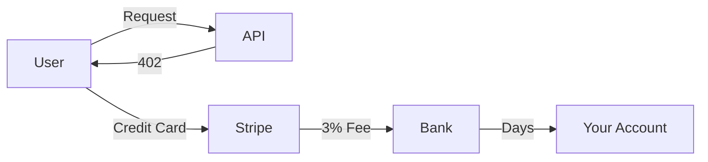
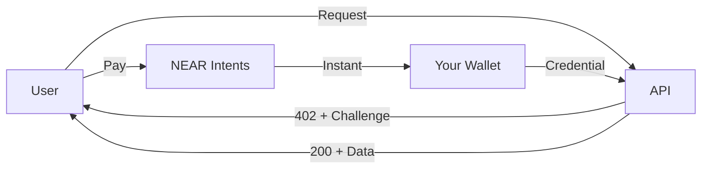

# MPP-NEAR

**Accept payments in your API with 3 lines of code**

Open-source primitives for the Machine Payments Protocol (MPP).
Built for NEAR. Works everywhere.

## The Problem

> **Building a paid API shouldn't require:**
> * Complex payment gateways
> * Credit card processing fees (2.9% + $0.30)
> * Subscription management systems
> * Geographic restrictions
> * Bank account verification

**Traditional payment flows are broken:**



**MPP fixes this:**



## The Solution: MPP-NEAR

MPP-NEAR implements the [Machine Payments Protocol](https://paymentauth.org/) - an open standard for HTTP 402 payments.

### ⚡ Instant Settlement
Payments settle in seconds, not days. No waiting for bank transfers.

### 💰 Near-Zero Fees
Pay ~$0.001 per transaction. No percentage fees. Keep what you earn.

### 🌍 Global by Default
No geographic restrictions. Anyone with crypto can pay.

### 🔓 Open Standard
Built on MPP-1.0 spec. Interoperable with any MPP implementation.

## How It Works

### 1. User Requests Your API

```bash
curl https://api.example.com/generate
```

### 2. You Return Payment Challenge

```http
HTTP/1.1 402 Payment Required
WWW-Authenticate: Payment id="abc123", realm="api.example.com",
  method="near-intents", amount="0.001", token="USDC"
```

### 3. User Pays & Retries

```bash
curl https://api.example.com/generate \\
  -H 'Authorization: Payment eyJjaGFsbGVuZ2UiOi...'
```

### 4. You Return Data

```http
HTTP/1.1 200 OK
Payment-Receipt: Payment id="xyz789", amount="0.001"

{"data": "..."}
```

**That's it.** No Stripe integration. No credit cards. No waiting.

## Features

* **[100% Spec Compliant](./quick-start)** - Implements MPP-1.0 specification exactly. Works with any MPP client.
* **[Type-Safe Primitives](./challenge)** - Strongly typed with builders. Catch errors at compile time, not runtime.
* **[Stateless Verification](./hmac-binding)** - HMAC binding lets you verify payments without a database.
* **[NEAR Intents](./payment-methods)** - Built-in support for gasless payments via NEAR Intents.
* **[RFC 9457 Errors](./problem)** - Standard error format for HTTP APIs. Machine-readable error details.
* **[RFC 9530 Digests](./body-digests)** - Bind payments to request bodies. Prevent replay attacks.

## Quick Start

### Install

```toml
# Cargo.toml
[dependencies]
mpp-near = { git = "https://github.com/Kampouse/mpp-near" }
```

### Create Challenge

```rust
use mpp_near::{Challenge, RequestData};

let challenge = Challenge::builder()
    .realm("api.example.com")
    .method("near-intents")
    .intent("charge")
    .request(RequestData::new("0.001", "wallet.near"))
    .secret(b"hmac-secret")
    .build()?;

// Return 402
let www_auth = challenge.to_www_authenticate();
```

### Verify Payment

```rust
use mpp_near::Credential;

let credential = Credential::from_authorization(auth_header)?;

if credential.verify_challenge_echo(&challenge)
    && challenge.verify_binding(b"hmac-secret") {
    // Payment valid - return data
}
```

**[Get Started →](/docs/app/quick-start)**

## Why MPP?

### For API Developers

**Traditional approach:**
- Integrate Stripe/Braintree/PayPal
- Handle webhooks
- Manage subscriptions
- Pay 2.9% + $0.30 per transaction
- Wait days for settlement
- Geographic restrictions

**With MPP-NEAR:**
- Add 3 lines of code
- Instant settlement
- ~$0.001 per transaction
- No restrictions
- No intermediaries

### For Users

**Traditional approach:**
- Enter credit card info
- Trust API with payment details
- Geographic restrictions
- Monthly subscriptions

**With MPP-NEAR:**
- Pay with crypto wallet
- No personal info shared
- Works everywhere
- Pay per request

## Use Cases

### AI/ML APIs

```rust
// Charge per generation
let challenge = Challenge::builder()
    .method("near-intents")
    .request(RequestData::new("0.01", "wallet.near"))
    .description("Image generation (512x512)")
    .build()?;
```

### Data APIs

```rust
// Charge per query
let challenge = Challenge::builder()
    .method("near-intents")
    .request(RequestData::new("0.001", "wallet.near"))
    .description("Database query")
    .build()?;
```

### Compute APIs

```rust
// Charge per computation
let challenge = Challenge::builder()
    .method("near-intents")
    .request(RequestData::new("0.05", "wallet.near"))
    .description("Model inference")
    .build()?;
```

## Pricing Comparison

| Service | Fee | Settlement | Global? |
|---------|-----|------------|---------|
| **Stripe** | 2.9% + $0.30 | 2-7 days | ❌ Restricted |
| **PayPal** | 2.9% + $0.30 | 3-5 days | ❌ Restricted |
| **MPP-NEAR** | ~$0.001 | Instant | ✅ Yes |

**Example:**

For a $0.01 API call:
- Stripe: $0.01 - ($0.01 × 0.029 + $0.30) = **-$0.29** (you lose money!)
- MPP-NEAR: $0.01 - $0.001 = **$0.009** (you keep 90%)

## Built on Standards

- **[MPP-1.0](https://paymentauth.org/)** - Machine Payments Protocol
- **[RFC 9457](https://www.rfc-editor.org/rfc/rfc9457)** - Problem Details for HTTP APIs
- **[RFC 9530](https://www.rfc-editor.org/rfc/rfc9530)** - Digest Fields
- **[NEAR Intents](https://near.org/intents)** - Gasless blockchain payments

## Open Source

MIT licensed. Built with ❤️ by the community.

- **GitHub:** [Kampouse/mpp-near](https://github.com/Kampouse/mpp-near)
- **Issues:** [Report bugs](https://github.com/Kampouse/mpp-near/issues)
- **Discord:** [Join community](https://discord.gg/clawd)

## Ready to Start?

**[Get Started →](./quick-start)** | [View on GitHub](https://github.com/Kampouse/mpp-near)
